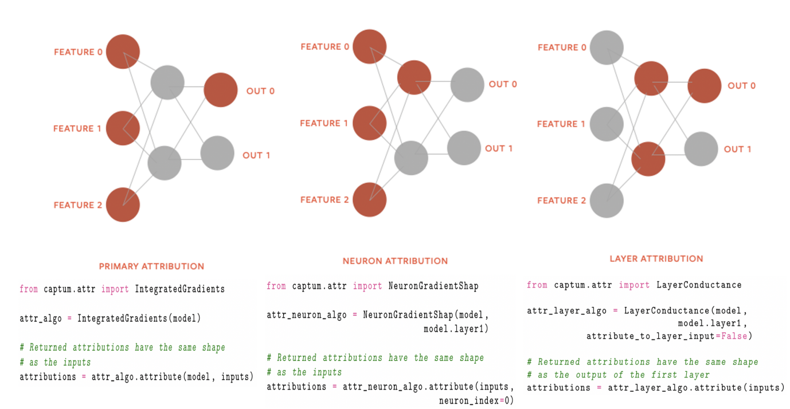

> 벡터 similarity 비교하는 빠른 라이브러리
> Similarity Search 3가지 축 : Accuracy, Search Speed, Memory ~ Exhaustive search, Pruning, Compression으로 달성 가능

Vector quantization : Compress an embedding vector into a single integer

L2거리, Inner Product 거리 중 선택 가능

Flat Index : Baseline (그냥 개별 인덱스에 개별 vector 박아넣는거)
LSH : hash table 이용해서 Indexing
NSW : 그래프 based world
HNSW : 하이랄키 + NSW ~ 층 나눈 상태에서 이동하면서 접근
IVF : Clustering 통해서 Indexing 하고, Query와 가까운 centroid 찾은 후, 해당 구역 내에서만 데이터 찾는 방식

https://github-wiki-see.page/m/facebookresearch/faiss/wiki/Faiss-indexes

 